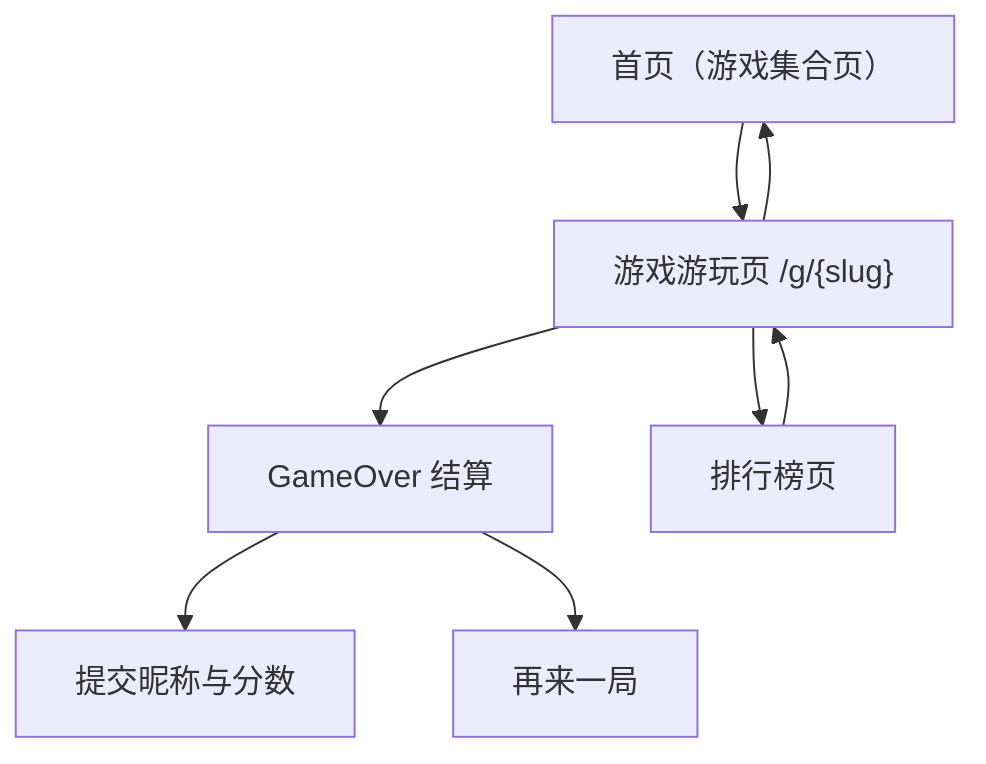

## 1. Product Overview
第二/第三批游戏线是在现有小游戏站内新增一组“低侵权风险、移动端友好、可SEO”的休闲游戏集合。
目标：用可复用的 Game 模板快速上新，统一支持 GameOver、排行榜、广告位与 SEO/FAQ。

## 2. Core Features

### 2.1 User Roles
本游戏线不强制账号体系：以“匿名昵称 + 设备标识”提交分数；后续如需跨设备可再引入登录。

| 角色 | 注册方式 | 核心权限 |
|------|---------|----------|
| 访客玩家 | 无需注册 | 游玩游戏、查看排行榜、在 GameOver 提交昵称与分数 |

### 2.2 Feature Module
本游戏线最小可用版本由以下页面构成：
1. **首页（游戏集合页）**：第二/第三批游戏入口卡片、搜索/筛选、SEO 文案区块。
2. **游戏游玩页（按 slug）**：移动端可玩、游戏内 HUD、暂停/重开、GameOver、排行榜入口、广告位、SEO/FAQ 区块。
3. **排行榜页**：按游戏维度的 Top 榜/我的最佳、时间范围筛选（如：今日/本周/历史）。

### 2.3 Page Details
| Page Name | Module Name | Feature description |
|-----------|-------------|---------------------|
| 首页（游戏集合页） | 游戏卡片列表 | 展示第二/第三批游戏卡片：封面、名称、一句话玩法、标签（单局时长/难度/操作方式）、进入按钮 |
| 首页（游戏集合页） | 搜索/筛选 | 按“操作方式（点击/滑动/拖拽）”“单局时长（≤1分钟/≤3分钟）”“类型（益智/反应/记忆）”筛选 |
| 首页（游戏集合页） | SEO 内容区 | 展示可编辑的标题/描述/FAQ 摘要（面向聚合页 SEO） |
| 游戏游玩页 | 游戏画布与输入 | 在移动端优先：触控操作映射（tap/swipe/drag）、横竖屏策略（默认竖屏；必要时提示旋转） |
| 游戏游玩页 | HUD/状态 | 显示分数、时间/步数、关卡（如适用）、暂停、重开、音效开关 |
| 游戏游玩页 | GameOver 流程 | 结束判定后展示结算：得分/最佳/再来一局；若进榜则引导输入昵称并提交 |
| 游戏游玩页 | 排行榜入口 | 提供“查看排行榜”按钮/Tab，跳转或打开排行榜页 |
| 游戏游玩页 | 广告位 | 预留广告位：顶部 Banner（可选）、GameOver 插屏位、（可选）奖励广告位；均需可配置开关 |
| 游戏游玩页 | SEO/FAQ 模板区块 | 以模板渲染：玩法简介、规则、操作方式、常见问题（可编辑） |
| 排行榜页 | 榜单展示 | 按游戏展示 Top N：昵称、分数、日期；支持“今日/本周/历史”切换 |
| 排行榜页 | 我的最佳 | 展示当前设备/昵称的最佳分数与排名（若可计算） |

## 3. Core Process
### 玩家主流程（适用于第二/第三批任一游戏）
1) 你从首页进入某个游戏游玩页（/g/{slug}）。
2) 你在移动端通过触控完成游戏操作；HUD 实时展示分数等信息。
3) 触发 GameOver 后展示结算页：得分、最佳分、再来一局。
4) 若分数达到提交阈值（例如进入 Top N 或超过个人最佳），你输入昵称并提交分数。
5) 你可跳转到排行榜页查看该游戏的榜单，并返回继续游玩。

### 第二/第三批优先级（以“交付速度 × 留存 × SEO 可做度 × 侵权风险”综合）
- P0（先做，模板验证）：
  - **数字合并类（Number Merge）**：规则简单、易移动端、SEO 词稳定。
  - **颜色排序类（Color Sort）**：操作直观、可短局。
  - **单词连线类（Word Connect）**：具备 FAQ/攻略内容空间，SEO 友好。
- P1（补充类型多样性）：
  - **记忆翻牌类（Memory Flip）**、**反应点击类（Reaction Tap）**。
- P2（后做，复杂度高或作弊风险高）：
  - **物理弹球/跑酷类**（调参成本高、榜单易刷）。

### slug/命名避侵权规则（必须遵守）
- 只使用“玩法机制 + 修饰词”的通用命名，不使用任何已知品牌/角色/影视/游戏 IP 名称。
- 不使用与竞品高度近似的专有名词、缩写、关卡名；不复刻 UI/图标/音效。
- slug 统一小写 kebab-case，长度建议 3–30 字符；仅含 a-z/0-9/-。
- 建议命名与 slug 示例（可直接落地）：
  - 数字合并：名称“数字合并挑战”，slug `number-merge`
  - 颜色排序：名称“试管颜色排序”，slug `color-sort`
  - 单词连线：名称“单词连线”，slug `word-connect`
  - 记忆翻牌：名称“记忆翻牌”，slug `memory-flip`
  - 反应点击：名称“极速点击”，slug `reaction-tap`

