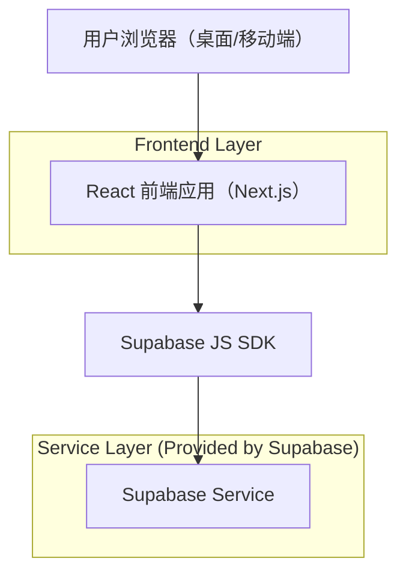
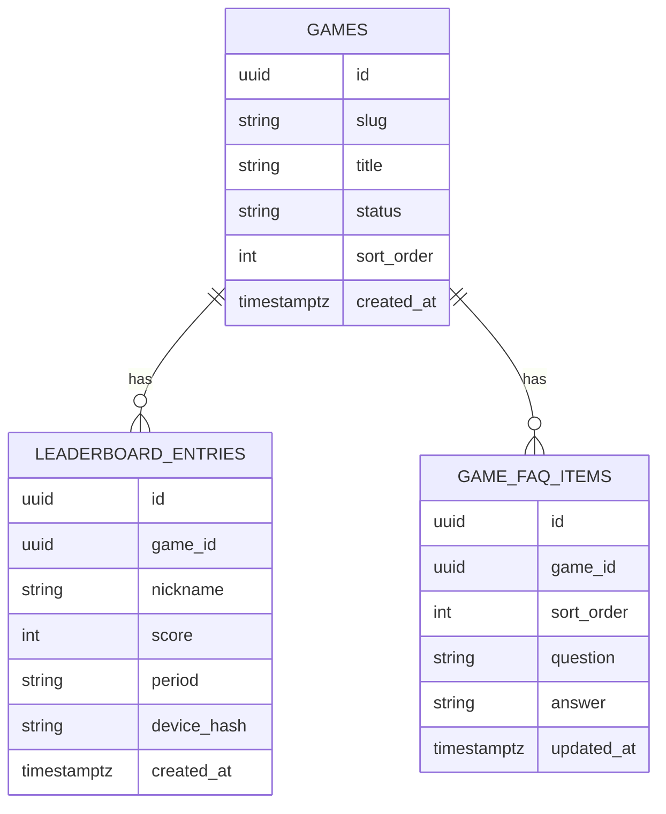

## 1.Architecture design


## 2.Technology Description
- Frontend: React@18 + Next.js（用于 SEO/路由） + tailwindcss@3
- Backend: None（直接使用 Supabase）
- Backend Service: Supabase（PostgreSQL + RPC + 可选 Auth）

## 3.Route definitions
| Route | Purpose |
|-------|---------|
| / | 首页：第二/第三批游戏集合入口与聚合 SEO 内容 |
| /g/[slug] | 游戏游玩页：移动端可玩 + GameOver + 广告位 + SEO/FAQ 区块 |
| /g/[slug]/leaderboard | 排行榜页：该游戏榜单、时间范围切换、我的最佳 |

## 6.Data model(if applicable)

### 6.1 Data model definition


### 6.2 Data Definition Language
GAMES
```
CREATE TABLE games (
  id UUID PRIMARY KEY DEFAULT gen_random_uuid(),
  slug TEXT UNIQUE NOT NULL,
  title TEXT NOT NULL,
  status TEXT NOT NULL DEFAULT 'draft',
  sort_order INT NOT NULL DEFAULT 0,
  created_at TIMESTAMPTZ NOT NULL DEFAULT NOW()
);

CREATE INDEX idx_games_sort_order ON games(sort_order);

GRANT SELECT ON games TO anon;
GRANT ALL PRIVILEGES ON games TO authenticated;
```

LEADERBOARD_ENTRIES
```
CREATE TABLE leaderboard_entries (
  id UUID PRIMARY KEY DEFAULT gen_random_uuid(),
  game_id UUID NOT NULL,
  nickname TEXT NOT NULL,
  score INT NOT NULL,
  period TEXT NOT NULL DEFAULT 'all',
  device_hash TEXT NOT NULL,
  created_at TIMESTAMPTZ NOT NULL DEFAULT NOW()
);

CREATE INDEX idx_leaderboard_game_period_score ON leaderboard_entries(game_id, period, score DESC);
CREATE INDEX idx_leaderboard_created_at ON leaderboard_entries(created_at DESC);

GRANT SELECT ON leaderboard_entries TO anon;
GRANT ALL PRIVILEGES ON leaderboard_entries TO authenticated;
```

GAME_FAQ_ITEMS
```
CREATE TABLE game_faq_items (
  id UUID PRIMARY KEY DEFAULT gen_random_uuid(),
  game_id UUID NOT NULL,
  sort_order INT NOT NULL DEFAULT 0,
  question TEXT NOT NULL,
  answer TEXT NOT NULL,
  updated_at TIMESTAMPTZ NOT NULL DEFAULT NOW()
);

CREATE INDEX idx_faq_game_sort ON game_faq_items(game_id, sort_order);

GRANT SELECT ON game_faq_items TO anon;
GRANT ALL PRIVILEGES ON game_faq_items TO authenticated;
```

补充说明（实现层约定）
- 逻辑外键：`leaderboard_entries.game_id`、`game_faq_items.game_id` 在应用层校验，不创建物理外键约束。
- 排行榜防滥用（轻量）：前端做基本校验（score 范围、频率限制），数据库侧可用 RPC 做二次校验与写入（可选）。
