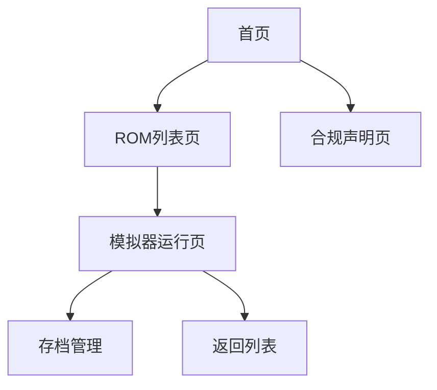

## 1. 产品概述
NES模拟器是一款基于Web的经典任天堂娱乐系统模拟器，支持浏览器内运行经典游戏，内置合规的可自由分发示例ROM列表，为用户提供怀旧游戏体验。
产品解决了经典游戏获取和运行门槛高的问题，面向复古游戏爱好者，通过合规的ROM分发和流畅的模拟体验，打造安全可靠的在线怀旧游戏平台。

## 2. 核心特性

### 2.1 用户角色
| 角色 | 注册方式 | 核心权限 |
|------|----------|----------|
| 访客用户 | 无需注册 | 浏览ROM列表，查看合规声明，运行示例ROM |
| 注册用户 | 邮箱注册/社交媒体登录 | 保存游戏进度，收藏喜欢的ROM，自定义模拟器设置 |

### 2.2 功能模块
产品主要包含以下核心页面：
1. **首页**：模拟器入口、推荐ROM展示、合规声明入口
2. **ROM列表页**：可自由分发的示例ROM列表，分类筛选，搜索功能
3. **模拟器运行页**：核心游戏运行界面，控制设置，存档管理
4. **合规声明页**：ROM版权说明，使用条款，合规性保障内容

### 2.3 页面详情
| 页面名称 | 模块名称 | 功能描述 |
|----------|----------|----------|
| 首页 | Hero区域 | 展示模拟器核心功能，提供立即体验入口，轮播推荐经典游戏 |
| 首页 | 导航栏 | 链接到ROM列表、合规声明、关于页面，响应式设计适配不同设备 |
| ROM列表页 | ROM展示卡片 | 每个ROM包含封面图、名称、发布年份、简介，支持点击进入游戏 |
| ROM列表页 | 筛选搜索 | 按游戏类型、年份筛选，支持关键词搜索，快速定位目标游戏 |
| 模拟器运行页 | 游戏画布 | 渲染NES游戏画面，支持全屏模式，保证60fps流畅运行 |
| 模拟器运行页 | 控制面板 | 虚拟按键适配触屏设备，支持键盘映射，自定义按键配置 |
| 模拟器运行页 | 存档系统 | 自动保存游戏进度，支持手动存档/读档，最多保留5个存档位 |
| 合规声明页 | 版权说明 | 详细说明所有内置ROM的合规性，授权来源，可自由分发的法律依据 |
| 合规声明页 | 使用条款 | 用户使用规范，禁止商用声明，版权保护责任划分 |

## 3. 核心流程

## 4. 用户界面设计
### 4.1 设计风格
- 主色调：复古深灰(#2d2d2d)搭配经典NES红(#e60012)，营造复古游戏氛围
- 按钮风格：圆角矩形，hover时有像素化动画效果，模拟复古游戏机按键
- 字体：使用Press Start 2P像素字体作为标题，正文使用Inter保证可读性
- 布局：卡片式布局展示ROM，模拟器页面采用沉浸式全屏设计
- 图标：使用8位像素风格图标，呼应NES时代的视觉特征

### 4.2 页面设计概述
| 页面名称 | 模块名称 | UI元素 |
|----------|----------|--------|
| 首页 | Hero区域 | 全屏背景，中央放置模拟器logo，下方CTA按钮，采用渐变色叠加 |
| ROM列表页 | ROM卡片 | 网格布局，每个卡片包含像素风格封面，悬停时放大并显示详情按钮 |
| 模拟器页 | 游戏画布 | 黑色边框包裹游戏画面，下方是虚拟按键区域，桌面端隐藏虚拟按键 |

### 4.3 响应性
采用桌面优先设计，同时支持移动端适配，触屏设备自动显示虚拟按键，保证跨平台游戏体验。

### 内置ROM合规性说明
所有内置ROM均为进入公有领域或获得作者授权可自由分发的作品，每个ROM详情页都标注具体授权类型，合规声明页面汇总所有授权信息，确保平台运营合法合规。