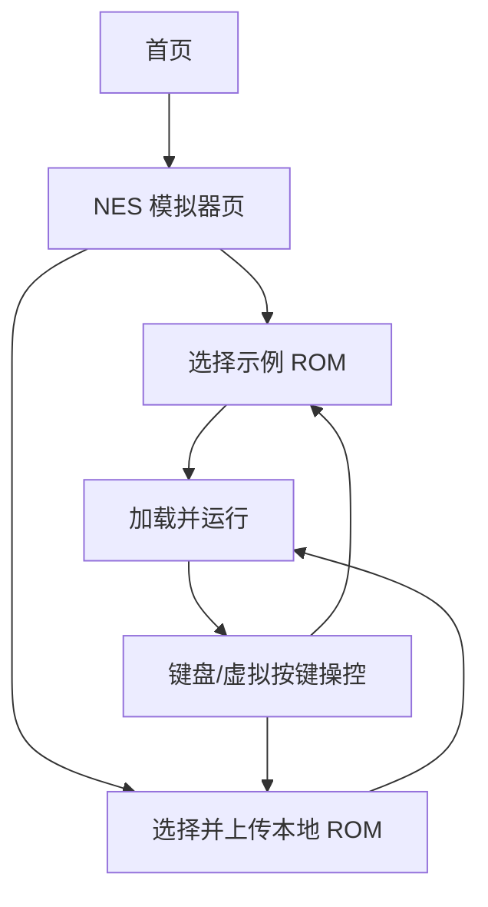

## 1. Product Overview
在站点新增一个 NES 模拟器页面，允许你在浏览器里本地上传并运行 NES ROM。
内置 3–5 个可自由分发 ROM 用于一键试玩，并在页面内标注许可与来源；同时支持你本地上传 ROM。
提供键盘操作与移动端虚拟按键，保证桌面与手机均可游玩。

## 2. Core Features

### 2.1 Feature Module
本需求由以下页面组成：
1. **首页**：新增入口卡片/导航、功能说明与合规提示。
2. **NES 模拟器页**：一键加载内置示例 ROM + 本地上传 ROM、运行画面、键盘映射提示、移动端虚拟按键。

### 2.2 Page Details
| Page Name | Module Name | Feature description |
|-----------|-------------|---------------------|
| 首页 | 入口与引导 | 引导你进入 NES 模拟器页；说明支持“一键试玩示例 ROM + 本地上传”。 |
| 首页 | 合规提示（静态内容） | 强调：示例 ROM 为可自由分发并标注许可来源；你上传的 ROM 仅在本地处理（不上传）。 |
| NES 模拟器页 | ROM 本地上传 | 选择本地 ROM 文件并加载；校验文件为空/格式不支持时提示错误；允许更换 ROM 重新加载。 |
| NES 模拟器页 | 示例 ROM 一键试玩 | 提供 3–5 个示例 ROM 列表，一键加载；展示每个 ROM 的名称、作者/项目、许可与来源链接。 |
| NES 模拟器页 | 模拟器运行区 | 展示游戏画面（Canvas）；提供运行状态提示（未加载/加载中/运行中/出错）。 |
| NES 模拟器页 | 键盘控制 | 支持桌面键盘按键输入；在页面内展示默认键位说明（如方向键、A/B、Start/Select 等）。 |
| NES 模拟器页 | 移动端虚拟按键 | 在触屏设备显示虚拟摇杆/方向键与 A/B/Start/Select；按下/抬起映射为模拟器按键事件。 |
| NES 模拟器页 | 合规提示（静态内容） | 展示“本站不提供 ROM、请确保你拥有使用权”的文案。 |

## 3. Core Process
- 你的主流程（示例 ROM）：从首页进入 NES 模拟器页 → 选择一个示例 ROM → 页面加载并开始运行 → 键盘/虚拟按键操控。
- 你的主流程（自带 ROM）：从首页进入 NES 模拟器页 → 选择并上传本地 ROM → 页面加载并开始运行 → 键盘/虚拟按键操控。

