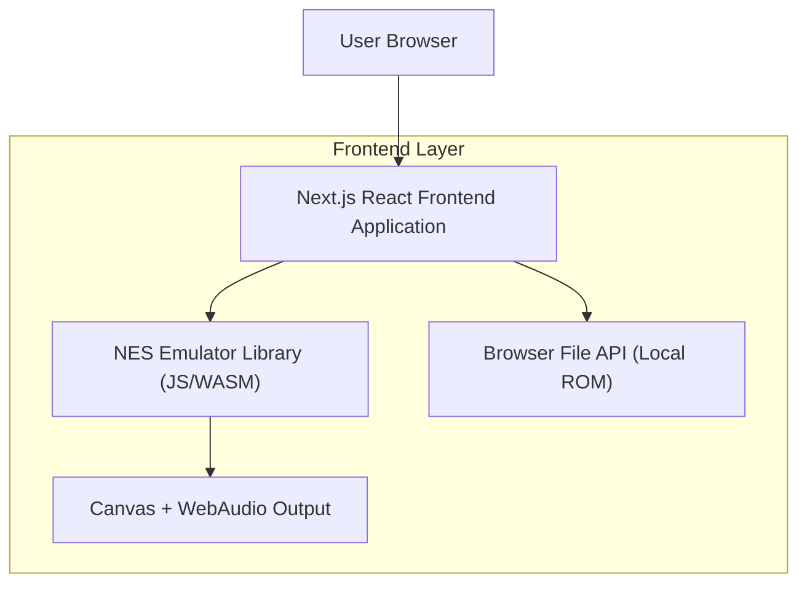

## 1.Architecture design

## 2.Technology Description
- Frontend: Next.js@16 + React@19 + TypeScript + tailwindcss@4
- Backend: None（ROM 在浏览器端读取与运行）

ROM 来源策略：
- 示例 ROM：在前端以 HTTPS 拉取可自由分发 ROM（不把商业 ROM 打包进站点），并在 UI 中展示许可与来源链接
- 用户 ROM：使用浏览器 File API 读取，仅在本地处理，不上传到服务器

## 3.Route definitions
| Route | Purpose |
|-------|---------|
| / | 首页：提供 NES 模拟器入口与使用须知（不提供 ROM） |
| /nes | NES 模拟器页：本地上传 ROM 并在浏览器运行；键盘与移动端虚拟按键操控 |

## 6.Data model(if applicable)
无（不需要服务端存储与数据库表支持本功能）。
