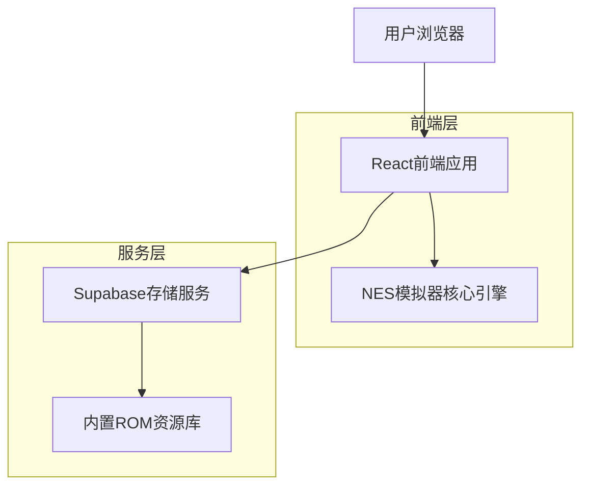
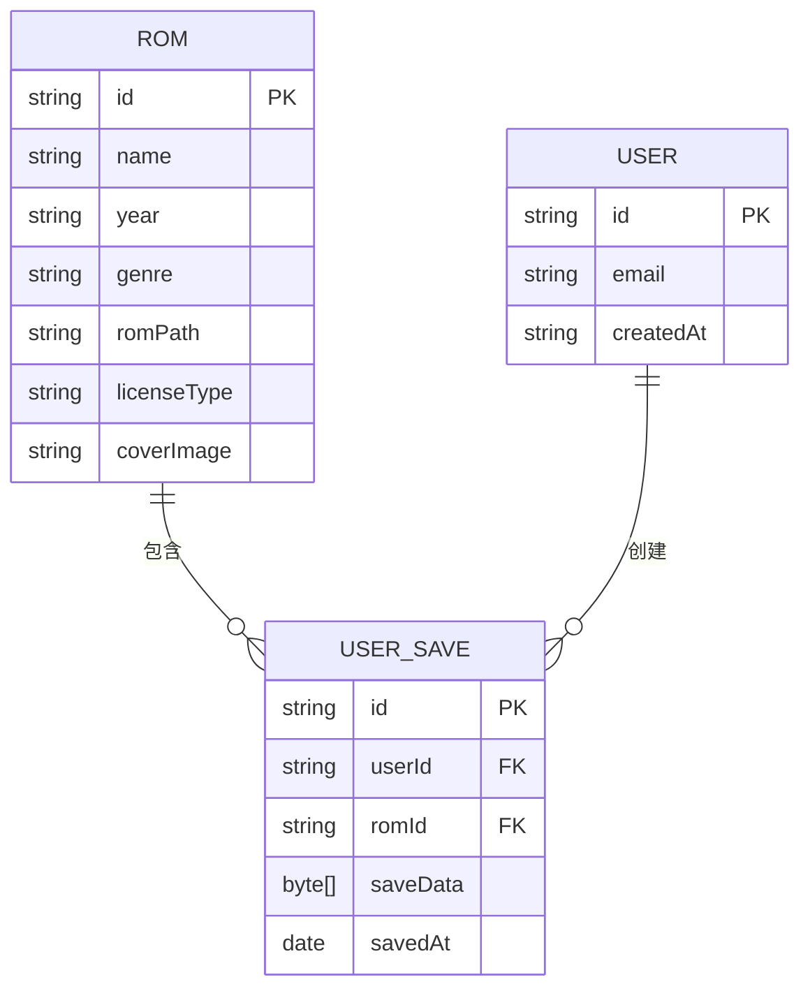

## 1. 架构设计


## 2. 技术栈说明
- 前端：React@18 + TypeScript + Vite + TailwindCSS
- 初始化工具：vite-init
- 模拟器核心：nes-emulator-core（WebAssembly实现）
- 后端服务：Supabase（对象存储存储ROM文件，用户认证）
- 多媒体处理：WebAudio API实现音频模拟

## 3. 路由定义
| 路由 | 用途 |
|------|------|
| / | 首页，展示模拟器入口和推荐内容 |
| /roms | ROM列表页，展示所有可自由分发的示例ROM |
| /play/:romId | 模拟器运行页，加载并运行指定ROM |
| /compliance | 合规声明页，展示版权和使用条款 |

## 4. 数据模型
### 4.1 数据模型定义


### 4.2 数据库DDL
```sql
-- 创建ROM信息表
CREATE TABLE roms (
    id UUID PRIMARY KEY DEFAULT gen_random_uuid(),
    name VARCHAR(100) NOT NULL,
    year VARCHAR(4),
    genre VARCHAR(50),
    rom_path VARCHAR(255) NOT NULL,
    license_type VARCHAR(100) NOT NULL,
    cover_image VARCHAR(255),
    created_at TIMESTAMP WITH TIME ZONE DEFAULT NOW()
);

-- 创建用户表
CREATE TABLE users (
    id UUID PRIMARY KEY DEFAULT gen_random_uuid(),
    email VARCHAR(255) UNIQUE NOT NULL,
    created_at TIMESTAMP WITH TIME ZONE DEFAULT NOW()
);

-- 创建存档表
CREATE TABLE user_saves (
    id UUID PRIMARY KEY DEFAULT gen_random_uuid(),
    user_id UUID REFERENCES users(id),
    rom_id UUID REFERENCES roms(id),
    save_data BYTEA,
    saved_at TIMESTAMP WITH TIME ZONE DEFAULT NOW()
);

-- 权限配置
GRANT SELECT ON roms TO anon;
GRANT ALL ON user_saves TO authenticated;
```

## 5. 核心API定义
### ROM列表获取
```
GET /api/roms
```
返回所有可用的合规ROM列表，包含基本信息和授权类型。

### 存档保存
```
POST /api/save
```
参数：
| 参数名 | 类型 | 是否必填 | 描述 |
|--------|------|----------|------|
| romId | string | 是 | ROM唯一标识 |
| saveData | byte[] | 是 | 游戏存档数据 |