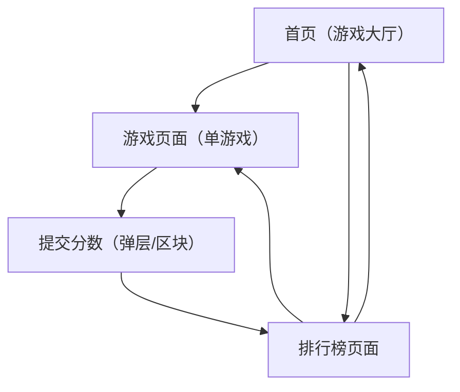

## 1. Product Overview
怀旧小游戏矩阵：提供 9 款即点即玩的网页小游戏，移动端可流畅游玩。
通过统一广告位占位与“玩→提交分数→看排行榜→再玩”的闭环，提高回访与停留。

## 2. Core Features

### 2.1 User Roles
| 角色 | 注册方式 | 核心权限 |
|------|----------|----------|
| 游客 | 无需注册（可选填写昵称） | 可玩全部游戏；可提交分数；可查看排行榜 |

### 2.2 Feature Module
我们的怀旧小游戏矩阵由以下页面构成：
1. **首页（游戏大厅）**：9 款游戏入口卡片、推荐/最新、全站 FAQ 摘要、广告位占位。
2. **游戏页面（单游戏）**：游戏容器与触控操作、暂停/重开、成绩计算与提交、该游戏 SEO(标题/描述/FAQ)、广告位占位、跳转排行榜。
3. **排行榜页面**：全站/单游戏排行榜切换、提交成功回流入口（再玩/换游戏）、广告位占位。

### 2.3 Page Details
| Page Name | Module Name | Feature description |
|-----------|-------------|---------------------|
| 首页（游戏大厅） | 游戏矩阵列表 | 展示 9 个游戏卡片（封面/名称/一句话描述/难度标签）；点击进入游戏页面 |
| 首页（游戏大厅） | 排行榜快捷入口 | 提供“全站排行榜/最近热玩”入口；支持按游戏快速筛选 |
| 首页（游戏大厅） | SEO（基础） | 渲染首页 title/description；展示 3-5 条站点级 FAQ（可折叠） |
| 首页（游戏大厅） | 广告位占位 | 固定展示统一广告位组件（顶部横幅 + 底部横幅），不影响交互 |
| 游戏页面（单游戏） | 游戏运行容器 | 加载对应游戏资源；提供开始/暂停/重开；保证移动端触控可操作（虚拟按键/滑动/点击） |
| 游戏页面（单游戏） | 成绩与提交 | 在游戏结束时计算分数；允许填写/修改昵称（可选）；一键提交分数；提交后引导查看排行榜 |
| 游戏页面（单游戏） | SEO（每游戏） | 为每个游戏渲染独立 title/description；展示该游戏 FAQ（3-6 条，折叠） |
| 游戏页面（单游戏） | 广告位占位 | 使用与首页一致的广告位组件；确保不会遮挡关键操作区（移动端自动避让） |
| 排行榜页面 | 榜单展示 | 展示 Top N（默认 50）；支持全站榜/单游戏榜切换；显示我的最好成绩（若有） |
| 排行榜页面 | 闭环回流 | 提供“再玩一次（回到该游戏）/去大厅换一个”CTA；在提交成功后自动落到对应榜单 |
| 排行榜页面 | 广告位占位 | 使用与首页一致的广告位组件 |

## 3. Core Process
**游客流程（默认）**
1) 进入首页浏览 9 款游戏 → 2) 点击任意游戏进入游戏页面 → 3) 在移动端/桌面完成一局 → 4) 结束后看到分数与“提交分数” → 5) 提交成功后跳转/打开排行榜（默认定位到该游戏）→ 6) 从排行榜选择“再玩一次”或“回大厅换游戏”，形成闭环。

