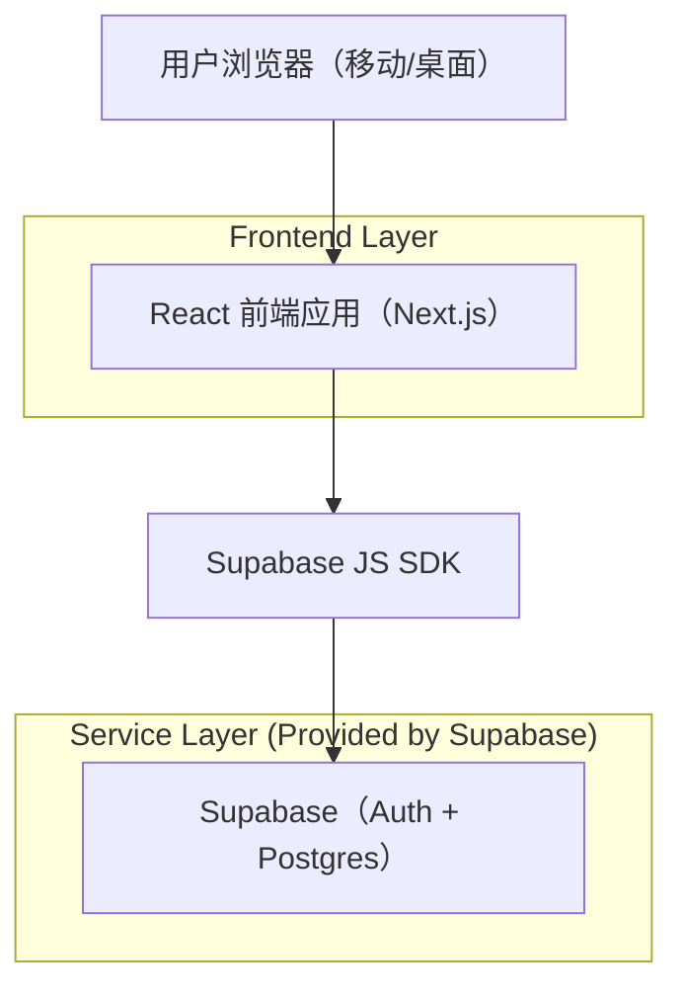
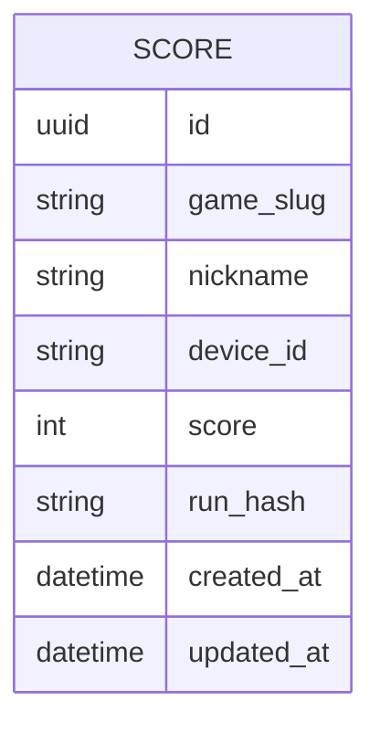

## 1.Architecture design


## 2.Technology Description
- Frontend: React@18 + Next.js（用于路由与基础 SEO） + Tailwind CSS
- Backend: None（直接使用 Supabase SDK）
- Database/Auth: Supabase (PostgreSQL + 可选匿名/游客身份)

## 3.Route definitions
| Route | Purpose |
|-------|---------|
| / | 首页（游戏大厅），聚合 9 个游戏入口与站点 FAQ |
| /games/[slug] | 游戏页面：加载具体游戏 + 该游戏 SEO/FAQ + 分数提交 |
| /leaderboard | 排行榜：全站榜/按游戏筛选 + 闭环回流 |

## 6.Data model(if applicable)

### 6.1 Data model definition


### 6.2 Data Definition Language
Score Table (scores)
```
-- create table
CREATE TABLE scores (
  id UUID PRIMARY KEY DEFAULT gen_random_uuid(),
  game_slug TEXT NOT NULL,
  nickname TEXT,
  device_id TEXT NOT NULL,
  score INT NOT NULL,
  run_hash TEXT,
  created_at TIMESTAMPTZ NOT NULL DEFAULT NOW(),
  updated_at TIMESTAMPTZ NOT NULL DEFAULT NOW()
);

-- indexes
CREATE INDEX idx_scores_game_slug_score ON scores (game_slug, score DESC);
CREATE INDEX idx_scores_device_game ON scores (device_id, game_slug);

-- (建议) 逻辑去重：应用层“每设备每游戏仅保留最高分”
-- 做法：提交时先查询 device_id + game_slug 的最高分，若更高则插入一条并在展示时取 max(score)。

-- grants (基础读取给 anon；写入策略由 RLS 控制)
GRANT SELECT ON scores TO anon;
GRANT ALL PRIVILEGES ON scores TO authenticated;
```

RLS（建议最小可用策略，允许游客提交）
- SELECT：anon 允许读取（仅排行榜需要的字段）。
- INSERT：anon 允许插入（提交分数），并通过应用层做基础校验（score 为正、game_slug 在白名单、nickname 长度限制）。
- UPDATE/DELETE：默认不开放。

说明
- “基础 SEO(标题/描述/FAQ)”由前端路由在页面级渲染元信息与 FAQ 结构化内容（不依赖数据库）。
- “统一广告位占位”作为前端通用组件（同尺寸、同位置规则），暂不接入真实广告 SDK。