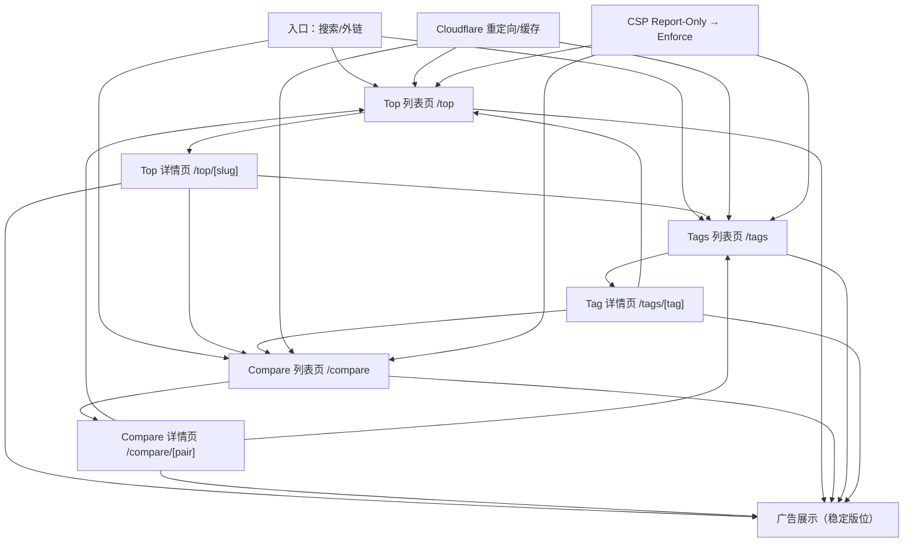

## 1. Product Overview
一个以“浏览器小游戏/放置/经营类游戏”为核心的内容站点，通过 Top 榜单、Compare 对比页、Tags 标签页提升 SEO 流量，并通过广告位实现变现。
聚焦：Cloudflare 重定向/缓存策略、CSP Report-Only 渐进上线、Top/Compare/Tags 内链增长与广告收入稳定性。

## 2. Core Features

### 2.1 User Roles
本阶段不区分用户角色（纯内容浏览 + 广告变现）。

### 2.2 Feature Module
站点由以下页面/模块构成：
1. **首页**：站点入口、核心导航、内容分发到 Top/Compare/Tags。
2. **Top 列表页（/top）**：榜单入口、榜单卡片、导流到 Tags/Compare、广告位。
3. **Top 详情页（/top/[slug]）**：榜单内容、相关内链模块（Tags/Compare/相关榜单）、广告位。
4. **Compare 列表页（/compare）**：对比入口集合、导流到 Top/Tags。
5. **Compare 详情页（/compare/[pair]）**：两款游戏对比信息、相关对比/相关标签/相关榜单内链、广告位。
6. **Tags 列表页（/tags）**：标签聚合、导流到 Tag 详情/Top/Compare、广告位。
7. **Tag 详情页（/tags/[tag]）**：标签下内容聚合、相关标签/相关对比/相关榜单内链、广告位。
8. **全站（通用）**：Cloudflare 重定向与缓存策略、CSP Report-Only 渐进上线与监控。

### 2.3 Page Details
| Page Name | Module Name | Feature description |
|-----------|-------------|------------------|
| 首页 | 导航与分发 | 展示主导航（Top/Compare/Tags 等）并提供入口卡片，将流量导向 3 个增长页体系。 |
| /top | 榜单入口集合 | 展示全部 Top 榜单入口；提供“Explore More”模块，固定导流到 /compare、/tags；为 SEO 提供 CollectionPage 结构化数据。 |
| /top | 广告位 | 在首屏与底部提供 banner 广告位；确保不影响首屏可用性（延迟加载/占位）。 |
| /top/[slug] | 榜单内容 | 展示榜单条目列表（含游戏卡片、跳转到游戏详情/玩法页）；支持基础 SEO（title/description/canonical/OG）。 |
| /top/[slug] | 内链增长块 | 在正文上/下方提供：相关 Tags、推荐 Compare、相关榜单（Top）三类模块；控制每类数量与去重，保持可爬取且不堆砌。 |
| /top/[slug] | 广告位 | 在榜单内容中段与底部提供广告位；在移动端折叠不关键的内链块以保证可读性。 |
| /compare | 对比入口集合 | 提供对比对列表（pair cards）；提供导流到 Top/Tags 的固定入口；为 SEO 提供 CollectionPage 结构化数据。 |
| /compare/[pair] | 对比内容 | 展示两款游戏的关键信息对比（品类、标签、玩法要点、适合人群等）；提供可复用的“下一步行动”CTA（去玩/看攻略/看榜单）。 |
| /compare/[pair] | 内链增长块 | 提供：更多相似对比（同品类/共享标签）、相关 Tags、相关 Top 榜单入口；保证内链是“主题相关”，避免随机扩散。 |
| /compare/[pair] | 广告位 | 在对比页首屏下方与内容结束处提供广告位；避免与主要 CTA 抢占同一视觉主导区域。 |
| /tags | 标签聚合 | 展示全量标签（可分组/排序）；提供导流到 Top/Compare 的 curated 模块；支持基础 SEO。 |
| /tags | 广告位 | 在标签列表上方与下方提供 banner 广告位；确保标签点击区域不被广告遮挡。 |
| /tags/[tag] | 标签内容聚合 | 展示该标签下的游戏列表；提供“相关标签”“热门榜单”“快速对比”内链模块，形成闭环流转。 |
| /tags/[tag] | 广告位 | 在列表顶部与分页/列表末尾提供广告位；确保列表滚动体验稳定（占位高度固定）。 |
| 全站（通用） | Cloudflare 重定向 | 统一域名规范化：www → apex、HTTP → HTTPS；在 Cloudflare 边缘优先完成重定向，减少源站压力与重复收录风险。 |
| 全站（通用） | Cloudflare 缓存 | 对静态与内容页设置长 s-maxage + stale-while-revalidate；对 /api、个性化/回源敏感路径设置 bypass；明确缓存键（忽略无关 query），降低重复缓存与命中率波动。 |
| 全站（通用） | CSP Report-Only 渐进上线 | 先全站 Report-Only 收集违规；按“先低风险页面→再增长页→再全站”逐步转 Enforce；提供报告聚合与发布门禁（违规率阈值）。 |

## 3. Core Process

### 3.1 用户增长与变现主流程
1) 你从搜索/外链进入 /top、/compare、/tags 之一。
2) 你阅读页面内容并通过“相关 Tags / 相关 Compare / 相关 Top”模块继续点击下一页，实现站内深度与主题聚合。
3) 你在每个页面的稳定广告位看到展示广告；站点在不牺牲可读性的前提下，提高有效曝光与可见率。

### 3.2 安全与性能上线流程（运维/产品联动）
1) 你先在 Cloudflare 配置重定向与缓存规则（与源站 Cache-Control 对齐）。
2) 你开启 CSP Report-Only 全量采集 7–14 天，修复/放行必要的第三方域名（如广告脚本、分析脚本）。
3) 你按路径灰度启用 CSP Enforce（优先静态页与低交互页），观察违规率与业务指标，再逐步扩大范围直至全站。

