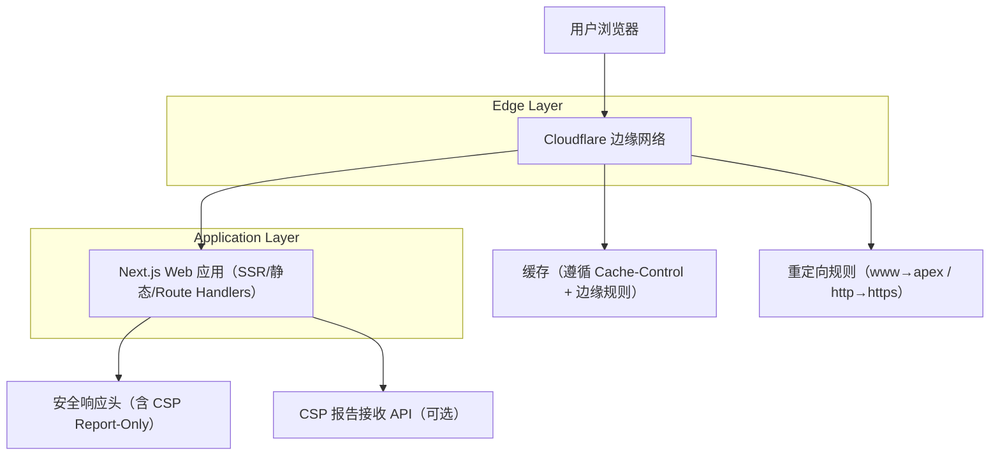
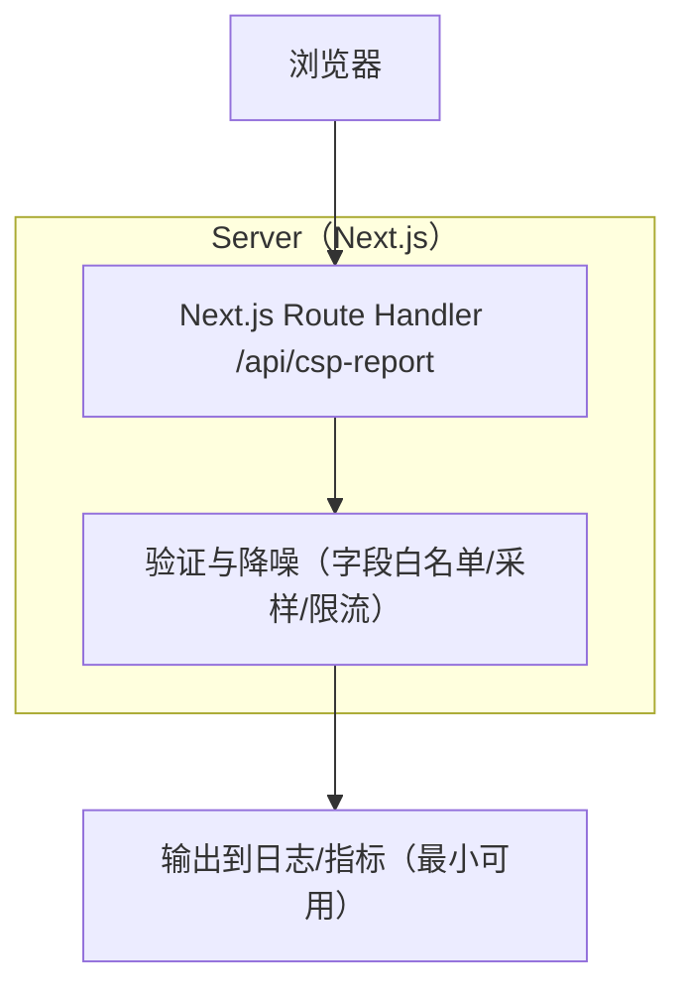

## 1.Architecture design


## 2.Technology Description
- Frontend: React（Next.js App Router） + TypeScript
- Backend: Next.js Route Handlers（仅用于必要的接收/转发，如 CSP 报告；否则无独立后端）
- Edge/CDN: Cloudflare（Redirect Rules / Cache Rules / TLS）

## 3.Route definitions
| Route | Purpose |
|-------|---------|
| / | 首页入口与导航分发 |
| /top | Top 榜单集合页（增长入口 + 广告） |
| /top/[slug] | Top 榜单详情页（内链增长 + 广告） |
| /compare | Compare 对比集合页（增长入口） |
| /compare/[pair] | Compare 详情页（内链增长 + 广告） |
| /tags | Tags 聚合页（增长入口 + 广告） |
| /tags/[tag] | Tag 详情聚合页（内链增长 + 广告） |
| /api/csp-report | （可选）接收浏览器 CSP violation 报告，用于 Report-Only 观测与灰度门禁 |

## 4.API definitions (If it includes backend services)
### 4.1 CSP 报告接收
```
POST /api/csp-report
```
Request（兼容主流浏览器上报；服务端以“容错解析 + 仅保留必要字段”为准）：
| Param Name| Param Type  | isRequired  | Description |
|-----------|-------------|-------------|-------------|
| body | object | true | CSP 报告原始 payload（可能为 `csp-report` 或 `violations` 结构） |
| userAgent | string | false | User-Agent（从 header 读取） |
| url | string | false | 当前页面 URL |

Response:
| Param Name| Param Type  | Description |
|-----------|-------------|-------------|
| ok | boolean | 是否接收成功 |

Example
```json
{"csp-report":{"document-uri":"https://promptinc.app/top","violated-directive":"script-src","blocked-uri":"https://example.com"}}
```

## 5.Server architecture diagram (If it includes backend services)


## 6.Data model(if applicable)
本阶段不强制落库。
- 最小可用方案：仅输出结构化日志，用于快速定位违规来源与趋势。
- 如后续需要报表：再引入 Cloudflare 侧日志/分析能力或轻量存储（仍建议优先复用 Cloudflare 能力，避免额外基础设施）。

### Cloudflare 配置要点（与代码头部策略对齐）
- 重定向优先在 Cloudflare 边缘完成：
  - www.promptinc.app → promptinc.app（301）
  - http → https（301）
- 缓存策略建议：
  - HTML 内容页：尊重源站 `Cache-Control`（例如 s-maxage + stale-while-revalidate），并通过 Cache Rules 统一 TTL 与 bypass 例外。
  - /api/*：默认 bypass cache。
  - sitemap.xml / robots.txt / ads.txt：可短 TTL（例如 1h）+ SWR。
- CSP 渐进上线：
  - 先全站 `Content-Security-Policy-Report-Only`，收敛白名单。
  - 再按路径灰度切换为 `Content-Security-Policy`（强制），并设置回滚开关（按规则/路径）。
